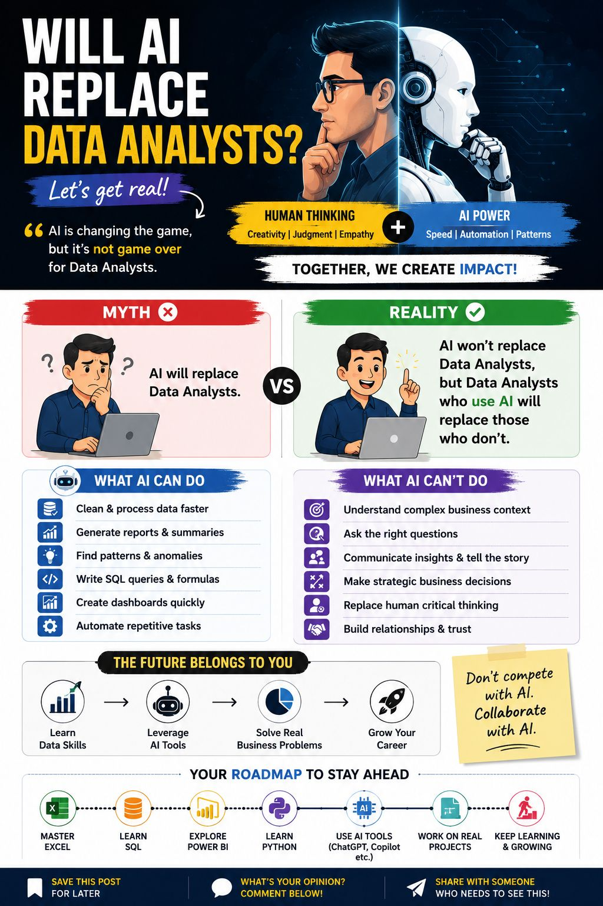

# Will AI Replace Data Analysts?

> 📅 Published: July 2026
> ⏱ Reading Time: 3 min
> 🎯 Level: Beginner → Intermediate
> 🏷 Category: Career
> 💼 Relevant Roles: Data Analyst, BI Analyst, anyone entering analytics
> 📚 Related Guide: [Data Analyst Workflow Guidebook](https://github.com/akxyverse/data-analytics-resources/tree/main/Data%20Analytics/Guidebooks/Data%20Analyst%20Workflow%20Guidebook)

## 📌 Key Takeaways

✔ AI won't replace Data Analysts — Data Analysts who use AI well will replace those who don't
✔ AI is strong at execution (cleaning, querying, dashboards); humans are still required for judgment (context, strategy, trust)
✔ The fundamentals (Excel, SQL) still come before AI tools in the learning order, not after

## Overview

AI tools can now clean data, write SQL, and build dashboards in seconds. That's a real shift — and a reasonable thing to be nervous about if data analysis is your career. This article looks at what AI actually replaces, what it doesn't, and what that means for how you should be spending your learning time right now.

## Why It Matters

The question "Will AI take my job?" is the wrong question to be asking. The useful one is: **"How do I make sure I'm the analyst using AI, not the one being outpaced by someone who is?"** AI won't replace Data Analysts. Data Analysts who use AI well will replace the ones who don't.

## The Concept: Human Thinking + AI Power

The two aren't in competition — they're complementary:

| Human Thinking | AI Power |
|---|---|
| Creativity | Speed |
| Judgment | Automation |
| Empathy | Pattern recognition |

**Together, they create impact.** Neither one alone gets you as far as the combination does.

### What AI Can Do

- Clean and process data faster
- Generate reports and summaries
- Find patterns and anomalies
- Write SQL queries and formulas
- Create dashboards quickly
- Automate repetitive tasks

### What AI Can't Do

- Understand complex business context
- Ask the right questions in the first place
- Communicate insights and tell the story behind them
- Make strategic business decisions
- Replace human critical thinking
- Build relationships and trust with stakeholders

Notice the pattern: AI is strong at *execution*. Humans are still required for *judgment* — deciding what's worth analyzing, what a number actually means for the business, and who needs to hear about it and how.

## Real-World Example

A retail team asks "why did sales drop last month?" AI can pull the numbers, spot that a specific region underperformed, and generate a clean chart in minutes. What it won't do on its own: know that the region had a store closure for renovation, connect that to the marketing calendar, or decide whether the finding is worth escalating to leadership before next quarter's planning. That synthesis is still the analyst's job.

## A Practical Roadmap

The infographic's own suggested path for staying ahead, in order:

**Master Excel → Learn SQL → Explore Power BI → Learn Python → Use AI Tools (ChatGPT, Copilot, etc.) → Work on Real Projects → Keep Learning & Growing**

Notice AI tools show up *after* the fundamentals, not instead of them — you need to know what a correct answer looks like before you can usefully supervise an AI's output.

## Common Mistakes

- Treating AI fluency as a replacement for SQL/Excel fundamentals, instead of a layer on top of them
- Accepting AI-generated output without checking it against domain knowledge
- Framing yourself as "competing" with AI instead of "collaborating" with it in interviews and on the job

## Best Practices

✔ Use AI to handle the mechanical parts of a task (cleaning, first-draft queries, formatting) so you spend more time on the parts that actually require judgment
✔ Always sanity-check AI output — speed doesn't equal correctness
✔ Get comfortable explaining your *reasoning*, not just your result — that's the part AI can't do for you in an interview

## Related Resources

- [Data Analyst Workflow Guidebook](https://github.com/akxyverse/data-analytics-resources/tree/main/Data%20Analytics/Guidebooks/Data%20Analyst%20Workflow%20Guidebook) — see where human judgment (Ask, Recommend, Validate) matters most across the 8-step process
- [ai-automation](https://github.com/akxyverse/ai-automation) — the AI tooling side of this equation

## Continue Learning

➡ [5 Data Analytics Myths You Should Stop Believing](./5-Data-Analytics-Myths-You-Should-Stop-Believing.md) — another common source of anxiety about "not knowing enough," addressed directly.

---

Originally shared on [LinkedIn](https://www.linkedin.com/in/akash-yadav-122a75288/). This article expands on that post with additional structure, examples, and cross-links — not a copy of the original text.
