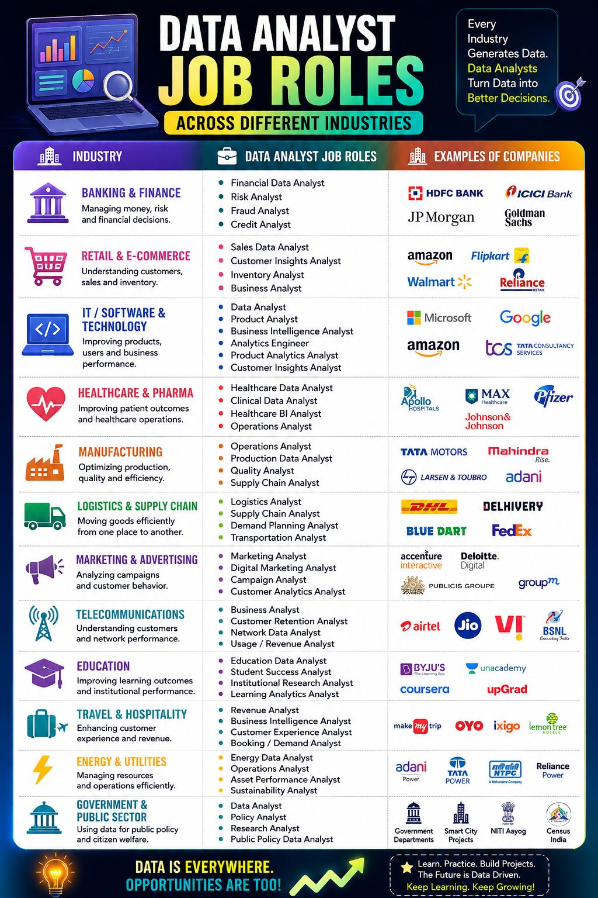

# Data Analyst Job Roles Across Different Industries

> 📅 Published: July 2026
> ⏱ Reading Time: 4 min
> 🎯 Level: Beginner
> 🏷 Category: Career
> 💼 Relevant Roles: Data Analyst, anyone choosing an industry to specialize in
> 📚 Related Guide: [Excel Roadmap Guide](https://github.com/akxyverse/data-analytics-resources/tree/main/Excel/Guidebooks/Excel%20Roadmap%20Guide)

## 📌 Key Takeaways

✔ Data Analyst roles exist in nearly every industry, not just IT/tech
✔ The tool stack (Excel, SQL, Python, Power BI, Tableau) stays largely consistent across industries — the business problems don't
✔ Picking a target industry is as important a decision as picking which tools to learn

## Overview

"Data Analyst" doesn't mean IT. Every industry generates data, and every industry needs people who can turn that data into better decisions. This article maps out 12 industries, the specific analyst roles inside each one, and real companies that hire for them.

## Why It Matters

**The tools may be the same — Excel, SQL, Python, Power BI, Tableau — but the business problems are different in every industry.** Deciding *which industry* excites you is just as important as deciding which tools to learn, and it's a decision most beginners skip entirely.

## Roles by Industry

| Industry | Focus | Example Roles | Example Companies |
|---|---|---|---|
| Banking & Finance | Managing money, risk, and financial decisions | Financial Data Analyst, Risk Analyst, Fraud Analyst, Credit Analyst | HDFC Bank, ICICI Bank, JP Morgan, Goldman Sachs |
| Retail & E-Commerce | Understanding customers, sales, and inventory | Sales Data Analyst, Customer Insights Analyst, Inventory Analyst, Business Analyst | Amazon, Flipkart, Walmart, Reliance Retail |
| IT / Software & Technology | Improving products, users, and business performance | Data Analyst, Product Analyst, BI Analyst, Analytics Engineer, Product Analytics Analyst | Microsoft, Google, Amazon, TCS |
| Healthcare & Pharma | Improving patient outcomes and operations | Healthcare Data Analyst, Clinical Data Analyst, Healthcare BI Analyst, Operations Analyst | Apollo Hospitals, Max Healthcare, Pfizer, Johnson & Johnson |
| Manufacturing | Optimizing production, quality, and efficiency | Operations Analyst, Production Data Analyst, Quality Analyst, Supply Chain Analyst | Tata Motors, Mahindra, Larsen & Toubro, Adani |
| Logistics & Supply Chain | Moving goods efficiently from one place to another | Logistics Analyst, Supply Chain Analyst, Demand Planning Analyst, Transportation Analyst | DHL, Delhivery, Blue Dart, FedEx |
| Marketing & Advertising | Analyzing campaigns and customer behavior | Marketing Analyst, Digital Marketing Analyst, Campaign Analyst, Customer Analytics Analyst | Accenture Interactive, Deloitte Digital, Publicis Groupe, GroupM |
| Telecommunications | Understanding customers and network performance | Business Analyst, Customer Retention Analyst, Network Data Analyst, Usage/Revenue Analyst | Airtel, Jio, Vi, BSNL |
| Education | Improving learning outcomes and institutional performance | Education Data Analyst, Student Success Analyst, Institutional Research Analyst, Learning Analytics Analyst | BYJU'S, Unacademy, Coursera, upGrad |
| Travel & Hospitality | Enhancing customer experience and revenue | Revenue Analyst, BI Analyst, Customer Experience Analyst, Booking/Demand Analyst | MakeMyTrip, OYO, ixigo, Lemon Tree Hotels |
| Energy & Utilities | Managing resources and operations efficiently | Energy Data Analyst, Operations Analyst, Asset Performance Analyst, Sustainability Analyst | Adani Power, Tata Power, NTPC, Reliance Power |
| Government & Public Sector | Using data for public policy and citizen welfare | Data Analyst, Policy Analyst, Research Analyst, Public Policy Data Analyst | Government Departments, Smart City Projects, NITI Aayog, Census India |

## Real-World Example

A "Sales Data Analyst" at a bank (HDFC) and a "Sales Data Analyst" at an e-commerce company (Flipkart) use nearly identical tools — SQL for querying transactions, Excel or Power BI for reporting — but ask completely different questions. One is looking at loan default risk and repayment patterns; the other is looking at cart abandonment and seasonal demand. Same title, same tool stack, genuinely different job.

## Common Mistakes

- Learning tools in a vacuum without ever picking a target industry to practice on — generic "sales data" datasets don't build the domain intuition a real role needs
- Assuming all Data Analyst roles are interchangeable across industries just because the tools overlap
- Overlooking industries outside tech (healthcare, logistics, government) that have just as much genuine analyst demand

## Best Practices

✔ Pick one or two industries that genuinely interest you and practice with datasets from that domain specifically
✔ Read a few real job postings in your target industry — the "nice to have" skills tell you what actually differentiates candidates there
✔ When building portfolio projects, frame the business question the way that industry would ask it (e.g. "reduce fraud losses," not just "analyze transactions")

## Related Resources

- [Data Roles Beyond Data Analyst](./Data-Roles-Beyond-Data-Analyst.md) — pick the role first, then the industry
- [Excel Syllabus Notebook](https://github.com/akxyverse/data-analytics-resources/tree/main/Excel/Guidebooks/Excel%20Syllabus%20Notebook) · [Excel Roadmap Guide](https://github.com/akxyverse/data-analytics-resources/tree/main/Excel/Guidebooks/Excel%20Roadmap%20Guide) — the tool stack that's consistent across every industry above

## Continue Learning

➡ [Will AI Replace Data Analysts?](./AI-and-the-Future-of-Data-Analysts.md) — whichever industry you land in, this is the skill-set question that applies everywhere.

---

Originally shared on [LinkedIn](https://www.linkedin.com/in/akash-yadav-122a75288/). This article expands on that post with additional structure, examples, and cross-links — not a copy of the original text. Company names are used as illustrative, publicly known industry examples.
