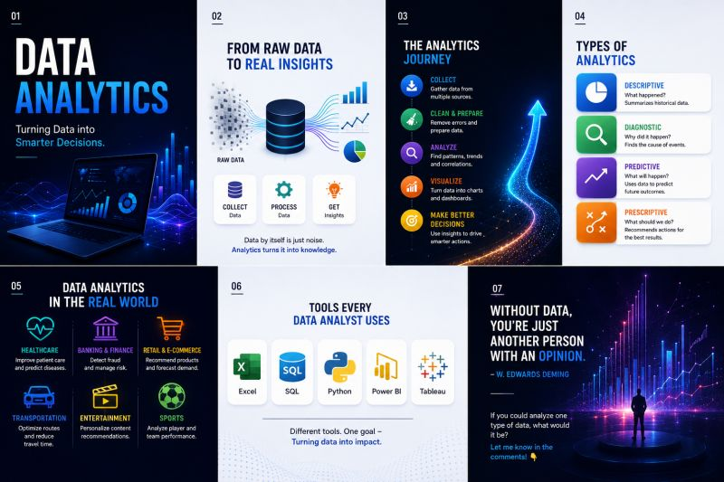

# The Data Analytics Journey

**Published:** 2026-07-04 · **Platform:** LinkedIn · **Type:** Post

## Overview

An introductory post on what Data Analytics actually is: the process of turning raw data into meaningful insight, laid out as a 5-step journey from collecting data through to making better decisions.

## Key Points

- The 5-step journey: Collect Data → Clean & Prepare → Analyze Patterns → Visualize Insights → Make Better Decisions
- Where it's used: healthcare, retail & e-commerce, banking & finance, transportation, entertainment, sports
- Why it matters: better decisions, efficiency, customer experience, cost reduction, growth

## Repository Contents

| File | What it is |
|---|---|
| `thumbnail.jpg` | Preview image shared in the post |
| `linkedin-post.md` | Full original post text |
| `linkedin-url.txt` | Link to the live LinkedIn post |
| `hashtags.md` | Hashtags used |
| `metadata.json` | Structured metadata |

## Related LinkedIn Post

[View the published post ↑](https://www.linkedin.com/posts/akash-yadav-122a75288_dataanalytics-datascience-dataanalyst-activity-7479076647913209856-6dF0)

## Related Repository

None — this post has no separate project repository.

## Related Content

None yet.

## Version History

| Version | Date | Notes |
|---|---|---|
| v1.0 | 2026-07-04 | Initial LinkedIn publication |

---

[← Back to LinkedIn Posts index](../../../INDEX.md)
