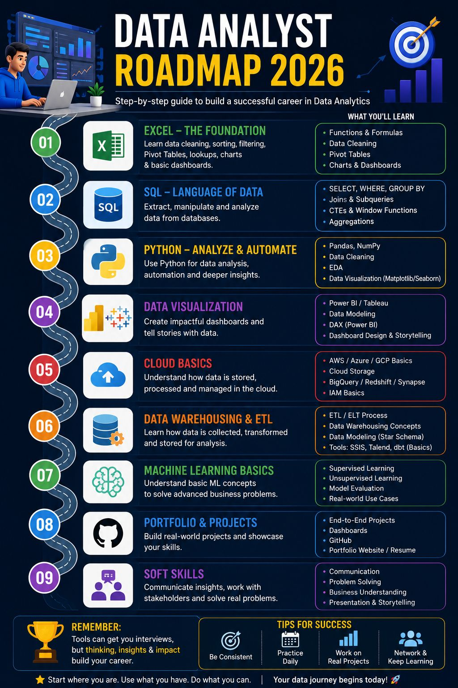

# Data Analyst Learning Roadmap

**Published:** 2026-07-05 · **Platform:** LinkedIn · **Type:** Post

## Overview

A practical, ordered learning path for becoming a Data Analyst — answering the common "should I learn Excel or Python first" question with a concrete sequence instead of a shortcut.

## Key Points

- Excel → SQL → Python → Power BI/Tableau → Statistics → Cloud Basics → Data Warehousing & ETL → Machine Learning Basics → Projects & Portfolio → Communication & Business Thinking
- Core argument: learning tools gets you interviews, solving real business problems builds the career

## Repository Contents

| File | What it is |
|---|---|
| `thumbnail.jpg` | Preview image shared in the post |
| `linkedin-post.md` | Full original post text |
| `linkedin-url.txt` | Link to the live LinkedIn post |
| `hashtags.md` | Hashtags used |
| `metadata.json` | Structured metadata |

## Related LinkedIn Post

[View the published post ↑](https://www.linkedin.com/posts/akash-yadav-122a75288_dataanalytics-dataanalyst-sql-activity-7479406401866543106-Jjlk)

## Related Repository

None — this post has no separate project repository.

## Related Content

None yet.

## Version History

| Version | Date | Notes |
|---|---|---|
| v1.0 | 2026-07-05 | Initial LinkedIn publication |

---

[← Back to LinkedIn Posts index](../../../INDEX.md)
