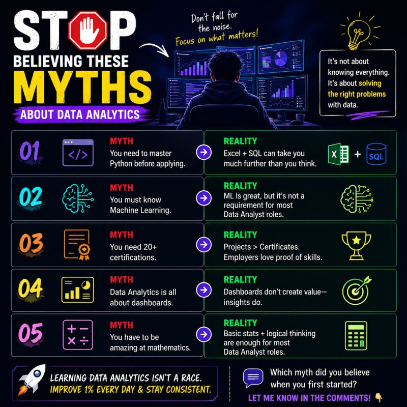

# 5 Data Analytics Myths You Should Stop Believing

 

**Published:** 2026-07-08 · **Platform:** LinkedIn · **Type:** Post

## Overview

Pushes back on 5 beginner myths about breaking into Data Analytics, and what's actually true instead.

## Key Points

- Myths debunked: must master Python first, ML is mandatory, need 20+ certifications, it's all about dashboards, need to be great at math
- Reality: Excel + SQL go further than expected, projects beat certificates, insights create value not dashboards themselves

## Repository Contents

| File | What it is |
|---|---|
| `thumbnail.jpg` | Preview image shared in the post |
| `linkedin-post.md` | Full original post text |
| `linkedin-url.txt` | Link to the live LinkedIn post |
| `hashtags.md` | Hashtags used |
| `metadata.json` | Structured metadata |

## Related LinkedIn Post

[View the published post ↑](https://www.linkedin.com/posts/akash-yadav-122a75288_dataanalytics-dataanalyst-sql-activity-7480533769595236352-5lXx)

## Related Repository

None — this post has no separate project repository.

## Related Content

[5 Data Analytics Myths You Should Stop Believing](<../../../../Articles/Career/5-Data-Analytics-Myths-You-Should-Stop-Believing.md>) — the expanded article version of this post

## Version History

| Version | Date | Notes |
|---|---|---|
| v1.0 | 2026-07-08 | Initial LinkedIn publication |

---

[← Back to LinkedIn Posts index](../../../INDEX.md)
