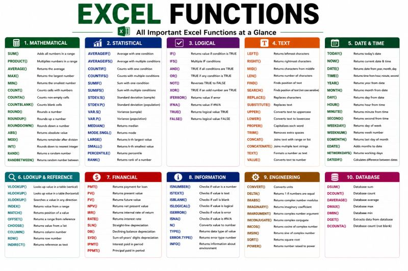

# Day 02 — Excel Functions

**Published:** 2026-07-10 · **Platform:** LinkedIn · **Type:** Post

## Overview

A learning-log entry practicing 10 core Excel functions, with the takeaway that knowing when to use a function matters more than knowing it exists.

## Key Points

- Functions practiced: SUM, AVERAGE, COUNT, IF, COUNTIF, VLOOKUP, XLOOKUP, INDEX+MATCH, CONCAT, TEXT functions

> This post used the `#90DaysChallenge` hashtag on LinkedIn. The corresponding GitHub-side tracking series (a dedicated `90 Day Challenge` folder in `career-hub`) was explicitly discontinued in a later session — this entry archives the post itself, not a revival of that tracking series.

## Repository Contents

| File | What it is |
|---|---|
| `thumbnail.jpg` | Preview image shared in the post |
| `linkedin-post.md` | Full original post text |
| `linkedin-url.txt` | Link to the live LinkedIn post |
| `hashtags.md` | Hashtags used |
| `metadata.json` | Structured metadata |

## Related LinkedIn Post

[View the published post ↑](https://www.linkedin.com/posts/akash-yadav-122a75288_day02-90dayschallenge-excel-activity-7481368502046638080-eQwo)

## Related Repository

None — this post has no separate project repository.

## Related Content

None yet.

## Version History

| Version | Date | Notes |
|---|---|---|
| v1.0 | 2026-07-10 | Initial LinkedIn publication |

---

[← Back to LinkedIn Posts index](../../../INDEX.md)
