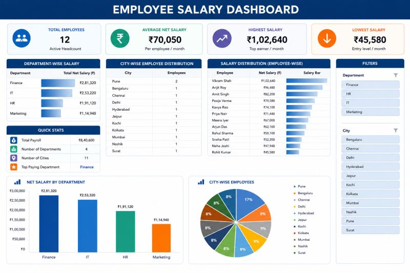

# HR Dashboard — Microsoft Excel

**Published:** 2026-08-03 · **Platform:** LinkedIn · **Tool:** Microsoft Excel

## Overview

An interactive HR dashboard that turns raw employee salary data into a
single, decision-ready view — department payroll, city-wise headcount,
salary range, and highest/lowest earners — filterable through slicers
instead of manually digging through spreadsheets.

## Business Problem

HR teams often manage employee information in spreadsheets, making it slow
to answer everyday business questions: which department has the highest
payroll, which city has the largest workforce, what the average salary is,
and who the highest/lowest earners are.

## Solution

Built a single-page Excel dashboard backed by pivot tables and pivot
charts, with department and city slicers so any of those questions can be
answered in a few clicks instead of manual filtering.

## Key Features

- **KPI Cards:** Total Employees, Average Net Salary, Highest Salary, Lowest Salary
- **Visualizations:** department-wise salary analysis, city-wise employee distribution, employee salary comparison
- **Interactive:** department & city slicers, dynamic pivot tables & charts, conditional formatting

## Key Insights

- Finance recorded the highest payroll
- Pune has the largest employee workforce
- Salaries range from ₹45,580 to ₹1,02,640

## Skills Demonstrated

Pivot Tables & Pivot Charts · KPI Cards · Slicers · Conditional Formatting ·
Dashboard Design · Data Visualization · Business Reporting

## Repository Contents

| File | What it is |
|---|---|
| [`thumbnail.jpg`](./thumbnail.jpg) | Screenshot of the finished dashboard |
| [`linkedin-post.md`](./linkedin-post.md) | Full original post text, as published |
| [`linkedin-url.txt`](./linkedin-url.txt) | Link to the live LinkedIn post |
| [`hashtags.md`](./hashtags.md) | Hashtags used on the post |
| [`metadata.json`](./metadata.json) | Structured metadata (title, date, tags) |

> No `Source Files/` folder yet — the original `.xlsx` workbook and dataset
> weren't provided when this entry was created. If you want them archived
> here too, they just need to be added.

## Related LinkedIn Post

[View the published post ↗](https://www.linkedin.com/posts/akash-yadav-122a75288_dataanalytics-microsoftexcel-exceldashboard-activity-7489784053198475264-thx-)

## Related Repository

None yet — the source workbook isn't archived anywhere in this ecosystem.
If it gets uploaded to a project repo later, this section should link there.

## Version History

| Version | Date | Notes |
|---|---|---|
| v1.0 | 2026-08-03 | Initial LinkedIn publication |

---

[← Back to LinkedIn Posts index](../../../INDEX.md)
