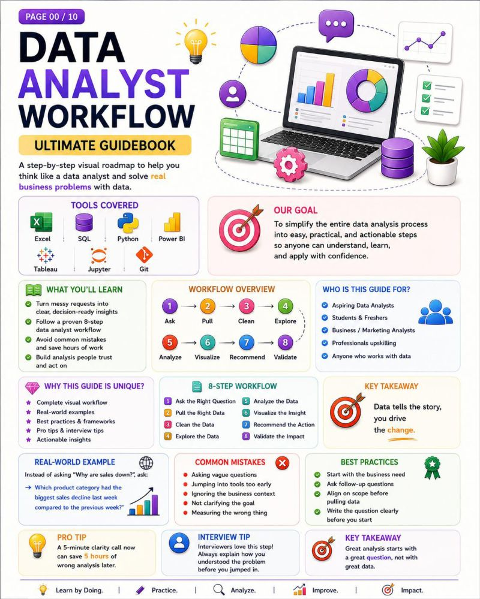

# Data Analyst Workflow

 

**Published:** 2026-07-28 · **Platform:** LinkedIn · **Type:** PDF Guidebook / Visual Guide

## Overview

A visual guide to the complete 8-step Data Analyst workflow, built around the idea that data doesn't create impact — decisions do.

## Key Points

- The 8 steps: Ask → Pull → Clean → Explore → Analyze → Visualize → Interpret → Communicate

## Repository Contents

| File | What it is |
|---|---|
| `thumbnail.jpg` | Cover / preview image |
| `linkedin-post.md` | Full original post text |
| `linkedin-url.txt` | Link to the live LinkedIn post |
| `hashtags.md` | Hashtags used |
| `metadata.json` | Structured metadata |

## Related LinkedIn Post

[View the published post ↑](https://www.linkedin.com/posts/akash-yadav-122a75288_dataanalytics-dataanalyst-sql-activity-7487884411758174208-W3Hk)

## Related Repository

[Data Analyst Workflow Guidebook](https://github.com/akxyverse/data-analytics-resources/tree/main/Data%20Analytics/Guidebooks/Data%20Analyst%20Workflow%20Guidebook) — full guide, hosted in `data-analytics-resources`

## Related Content

None yet.

## Version History

| Version | Date | Notes |
|---|---|---|
| v1.0 | 2026-07-28 | Initial LinkedIn publication |

---

[← Back to LinkedIn Posts index](../../INDEX.md)
