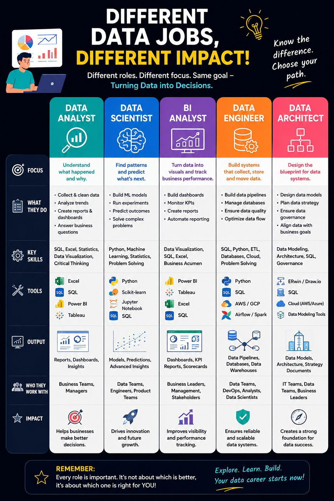

# Data Roles Beyond Data Analyst

 

**Published:** 2026-07-12 · **Platform:** LinkedIn · **Type:** Post

## Overview

Breaks down 5 distinct data roles and how their responsibilities actually differ, arguing against treating every data professional as "a Data Analyst."

## Business Problem

One of the biggest misconceptions in tech is that every data professional does the same job — they don't, and conflating the roles makes it harder to know which one you're actually aiming for.

## Solution

Breaks down 5 distinct roles by what each one actually answers, using a sports-team analogy: different players, same goal.

## Key Highlights

- Data Analyst → what happened. BI Analyst → dashboards & KPIs. Data Scientist → what's likely to happen next. Data Engineer → pipelines. Data Architect → infrastructure design

## Repository Contents

| File | What it is |
|---|---|
| `thumbnail.jpg` | Preview image shared in the post |
| `linkedin-post.md` | Full original post text |
| `linkedin-url.txt` | Link to the live LinkedIn post |
| `hashtags.md` | Hashtags used |
| `metadata.json` | Structured metadata |

## Related LinkedIn Post

[View the published post ↑](https://www.linkedin.com/posts/akash-yadav-122a75288_dataanalytics-datascience-businessintelligence-activity-7481904200176582656-bxXW)

## Related Repository

None — this post has no separate project repository.

## Related Content

[Data Roles Beyond Data Analyst](<../../../Articles/Career/Data-Roles-Beyond-Data-Analyst.md>) — the expanded article version of this post

## Version History

| Version | Date | Notes |
|---|---|---|
| v1.0 | 2026-07-12 | Initial LinkedIn publication |

## Explore More Content

- 📝 [Data Analyst Careers Across 12 Industries](<../Data Analyst Careers Across 12 Industries>) — where these roles actually get hired
- 📝 [5 Data Analytics Myths You Should Stop Believing](<../5 Data Analytics Myths You Should Stop Believing>) — more beginner misconceptions, cleared up
- 🚀 [Browse the full gallery ↗](../../README.md)

---

[← Back to LinkedIn Posts index](../../INDEX.md)
