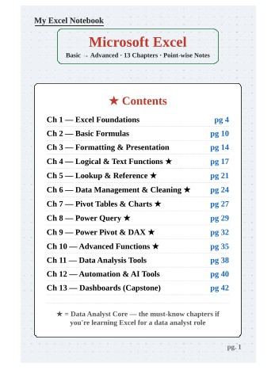

# Excel Syllabus

  

**Published:** 2026-07-18 · **Platform:** LinkedIn · **Type:** PDF Guidebook (38 pages)

## Overview

A 38-page handwritten-style Excel syllabus, created as a personal structured self-study checklist covering Excel end-to-end.

## Why I Built This

Straight from the post: *"The real challenge wasn't finding resources. It was knowing what to learn first. Instead of learning random topics, I decided to create and follow a structured Excel syllabus."*

## Business Problem

Thousands of Excel tutorials exist, but picking one topic to start with — and what comes after — is the actual hard part for beginners.

## Solution

A handwritten, structured self-study checklist covering Excel end-to-end, meant to be worked through step by step rather than searched piecemeal.

## Key Highlights

- Covers: Excel Basics, Formulas & Functions, Logical/Text/Date Functions, Lookup Functions, Data Cleaning & Validation, Conditional Formatting, Tables/Sorting/Filtering, Pivot Tables & Charts, Interactive Dashboards, Power Query, Basic VBA & Automation, Dynamic Array Functions, Real-World Projects

## Repository Contents

| File | What it is |
|---|---|
| `thumbnail.jpg` | Cover / preview image |
| `linkedin-post.md` | Full original post text |
| `linkedin-url.txt` | Link to the live LinkedIn post |
| `hashtags.md` | Hashtags used |
| `metadata.json` | Structured metadata |

## Related LinkedIn Post

[View the published post ↑](https://www.linkedin.com/posts/akash-yadav-122a75288_complete-excel-syllabus-activity-7484120681761333249-mW1r)

## Related Repository

[Excel Syllabus Notebook](https://github.com/akxyverse/data-analytics-resources/tree/main/Excel/Guidebooks/Excel%20Syllabus%20Notebook) — full 38-page guide, hosted in `data-analytics-resources`

## Related Content

None yet.

## Version History

| Version | Date | Notes |
|---|---|---|
| v1.0 | 2026-07-18 | Initial LinkedIn publication |

## Explore More Content

- 📗 [Excel Ultimate Guidebook](<../Excel Ultimate Guidebook>) — 21-page visual guide, basics through AI features
- 📘 [Excel Roadmap Guide](<../Excel Roadmap Guide>) — 6-page what-to-learn-next roadmap
- 🚀 [Browse the full gallery ↗](../../README.md)

---

[← Back to LinkedIn Posts index](../../INDEX.md)
