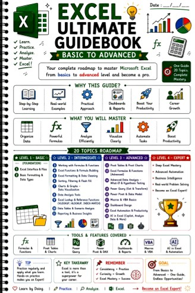

# Excel Ultimate Guidebook

  

**Published:** 2026-07-27 · **Platform:** LinkedIn · **Type:** PDF Guidebook (21 pages)

## Overview

A 21-page handwritten-style visual guidebook covering Excel basic-to-advanced, spanning 20 topics with real-world examples and interview-focused concepts.

## Why I Built This

Straight from the post: *"I wanted to create a guide that is easy to understand, visually engaging, and practical for real-world work — not just another collection of notes."*

## Business Problem

Most Excel guides are dry reference notes — accurate, but not something you'd actually enjoy working through cover to cover.

## Solution

A handwritten-style visual guidebook, 20 topics structured Beginner → Intermediate → Advanced, with real-world examples and interview-focused concepts rather than just formula syntax.

## Key Highlights

- Covers: Excel Interface & Files, Formatting & Data Cleaning, Functions & Formulas, Charts & Data Visualization, Data Analysis Tools, VLOOKUP/XLOOKUP/INDEX-MATCH, Pivot Tables & Charts, Advanced Formulas, Power Query & Power Pivot, Dashboards, Macros & VBA, Excel Automation, AI in Excel (Copilot & Analyze Data)

## Repository Contents

| File | What it is |
|---|---|
| `thumbnail.jpg` | Cover / preview image |
| `linkedin-post.md` | Full original post text |
| `linkedin-url.txt` | Link to the live LinkedIn post |
| `hashtags.md` | Hashtags used |
| `metadata.json` | Structured metadata |

## Related LinkedIn Post

[View the published post ↑](https://www.linkedin.com/posts/akash-yadav-122a75288_excel-ultimate-guidebook-activity-7487458274418782209-zNl8)

## Related Repository

[Excel Ultimate Guidebook](https://github.com/akxyverse/data-analytics-resources/tree/main/Excel/Guidebooks/Excel%20Ultimate%20Guidebook) — full 21-page guide, hosted in `data-analytics-resources`

## Related Content

None yet.

## Version History

| Version | Date | Notes |
|---|---|---|
| v1.0 | 2026-07-27 | Initial LinkedIn publication |

## Explore More Content

- 📗 [Excel Syllabus](<../Excel Syllabus>) — 38-page structured self-study checklist
- 📘 [Excel Roadmap Guide](<../Excel Roadmap Guide>) — 6-page what-to-learn-next roadmap
- 🚀 [Browse the full gallery ↗](../../README.md)

---

[← Back to LinkedIn Posts index](../../INDEX.md)
