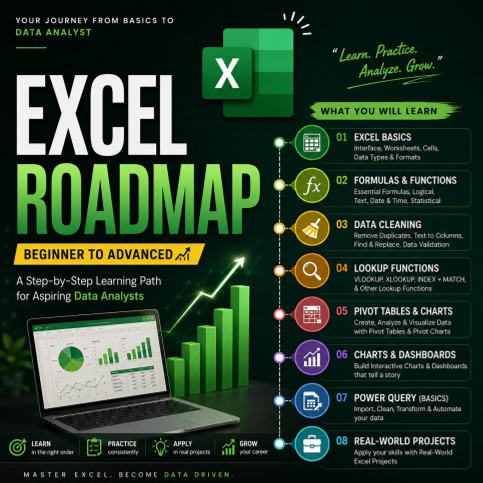

# 🚀 LinkedIn Content Library

**Every post I've published on LinkedIn, browsable by what it actually is — not by when it happened.**

 

## 📈 At a Glance

| | | | |
|---|---|---|---|
| 📌 **Total Posts** — 12 | 📊 **Dashboards** — 1 | 📚 **Guidebooks** — 4 | 📖 **Resources** — 2 |
| 📝 **Career** — 4 | 💻 **Excel** — 1 | 🔥 **Latest** — [HR Dashboard](<./2026/08-August/2026-08-03_HR-Dashboard-Excel>), Aug 2026 | 🗓 **Earliest** — [The Data Analytics Journey](<./2026/07-July/2026-07-04_Data-Analytics-Journey>), Jul 2026 |

---

## 📊 Dashboards

<table>
<tr>
<td width="30%" align="center"><a href="<./2026/08-August/2026-08-03_HR-Dashboard-Excel>"></a></td>
<td valign="top">

**[HR Dashboard](<./2026/08-August/2026-08-03_HR-Dashboard-Excel>)**
 Interactive Excel dashboard turning employee salary data into decision-ready KPIs — payroll, headcount, salary range, filterable by department and city.
 `Excel` · Aug 2026

</td>
</tr>
</table>

## 📚 Guidebooks

<table>
<tr>
<td width="30%" align="center"><a href="<./2026/07-July/2026-07-27_Excel-Ultimate-Guidebook>"></a></td>
<td valign="top">

**[Excel Ultimate Guidebook](<./2026/07-July/2026-07-27_Excel-Ultimate-Guidebook>)**
 21-page handwritten-style guide, Excel basics through AI features (Copilot, Analyze Data).
 `Excel` · 21 pages · Jul 2026 · [Full guide on GitHub ↗](https://github.com/akxyverse/data-analytics-resources/tree/main/Excel/Guidebooks/Excel%20Ultimate%20Guidebook)

</td>
</tr>
<tr>
<td width="30%" align="center"><a href="<./2026/07-July/2026-07-18_Excel-Syllabus>"></a></td>
<td valign="top">

**[Excel Syllabus](<./2026/07-July/2026-07-18_Excel-Syllabus>)**
 38-page handwritten Excel syllabus — a personal structured self-study checklist, basics through VBA & dynamic arrays.
 `Excel` · 38 pages · Jul 2026 · [Full guide on GitHub ↗](https://github.com/akxyverse/data-analytics-resources/tree/main/Excel/Guidebooks/Excel%20Syllabus%20Notebook)

</td>
</tr>
<tr>
<td width="30%" align="center"><a href="<./2026/07-July/2026-07-17_Excel-Roadmap-Guide>"></a></td>
<td valign="top">

**[Excel Roadmap Guide](<./2026/07-July/2026-07-17_Excel-Roadmap-Guide>)**
 6-page structured Excel roadmap — what to learn next, not just what to learn.
 `Excel` · 6 pages · Jul 2026 · [Full guide on GitHub ↗](https://github.com/akxyverse/data-analytics-resources/tree/main/Excel/Guidebooks/Excel%20Roadmap%20Guide)

</td>
</tr>
<tr>
<td width="30%" align="center"><a href="<./2026/07-July/2026-07-28_Data-Analyst-Workflow>"></a></td>
<td valign="top">

**[Data Analyst Workflow](<./2026/07-July/2026-07-28_Data-Analyst-Workflow>)**
 Visual guide to the complete 8-step Data Analyst workflow — Ask → Pull → Clean → Explore → Analyze → Visualize → Interpret → Communicate.
 Jul 2026 · [Full guide on GitHub ↗](https://github.com/akxyverse/data-analytics-resources/tree/main/Data%20Analytics/Guidebooks/Data%20Analyst%20Workflow%20Guidebook)

</td>
</tr>
</table>

## 📝 Career

<table>
<tr>
<td width="30%" align="center"><a href="<./2026/07-July/2026-07-16_AI-and-the-Future-of-Data-Analysts>"></a></td>
<td valign="top">

**[AI and the Future of Data Analysts](<./2026/07-July/2026-07-16_AI-and-the-Future-of-Data-Analysts>)**
 AI won't replace Data Analysts — but analysts who use AI will outperform those who don't.
 Jul 2026 · [Read the expanded article ↗](../Articles/Career/AI-and-the-Future-of-Data-Analysts.md)

</td>
</tr>
<tr>
<td width="30%" align="center"><a href="<./2026/07-July/2026-07-13_Data-Analyst-Careers-Across-12-Industries>"></a></td>
<td valign="top">

**[Data Analyst Careers Across 12 Industries](<./2026/07-July/2026-07-13_Data-Analyst-Careers-Across-12-Industries>)**
 Where you can actually build a Data Analyst career — from Banking to Government, 12 industries mapped.
 Jul 2026 · [Read the expanded article ↗](../Articles/Career/Data-Analyst-Careers-Across-12-Industries.md)

</td>
</tr>
<tr>
<td width="30%" align="center"><a href="<./2026/07-July/2026-07-12_Data-Roles-Beyond-Data-Analyst>"></a></td>
<td valign="top">

**[Data Roles Beyond Data Analyst](<./2026/07-July/2026-07-12_Data-Roles-Beyond-Data-Analyst>)**
 Data Analyst, BI Analyst, Data Scientist, Data Engineer, Data Architect — 5 roles, 5 different jobs.
 Jul 2026 · [Read the expanded article ↗](../Articles/Career/Data-Roles-Beyond-Data-Analyst.md)

</td>
</tr>
<tr>
<td width="30%" align="center"><a href="<./2026/07-July/2026-07-08_5-Data-Analytics-Myths>"></a></td>
<td valign="top">

**[5 Data Analytics Myths You Should Stop Believing](<./2026/07-July/2026-07-08_5-Data-Analytics-Myths>)**
 Excel + SQL go further than you think. Projects beat certificates.
 Jul 2026 · [Read the expanded article ↗](../Articles/Career/5-Data-Analytics-Myths-You-Should-Stop-Believing.md)

</td>
</tr>
</table>

## 📖 Resources

<table>
<tr>
<td width="30%" align="center"><a href="<./2026/07-July/2026-07-05_Data-Analyst-Learning-Roadmap>"></a></td>
<td valign="top">

**[Data Analyst Learning Roadmap](<./2026/07-July/2026-07-05_Data-Analyst-Learning-Roadmap>)**
 A practical, ordered learning path — Excel → SQL → Python → BI tools → Statistics → Projects.
 Jul 2026

</td>
</tr>
<tr>
<td width="30%" align="center"><a href="<./2026/07-July/2026-07-04_Data-Analytics-Journey>"></a></td>
<td valign="top">

**[The Data Analytics Journey](<./2026/07-July/2026-07-04_Data-Analytics-Journey>)**
 What Data Analytics actually is — the 5-step journey from raw data to better decisions.
 Jul 2026

</td>
</tr>
</table>

## 💻 Excel Learning Log

<table>
<tr>
<td width="30%" align="center"><a href="<./2026/07-July/2026-07-10_Day02-Excel-Functions>"></a></td>
<td valign="top">

**[Day 02 — Excel Functions](<./2026/07-July/2026-07-10_Day02-Excel-Functions>)**
 10 core Excel functions practiced — SUM through XLOOKUP and INDEX+MATCH.
 `Excel` · Jul 2026

</td>
</tr>
</table>

---

## 🤝 Connect

 

Full chronological list: [`INDEX.md`](./INDEX.md) · For contributors/maintainers: [structure & templates](<./Templates/README.md>)

---

[← Back to Content Studio root](../README.md)
