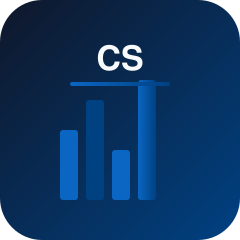
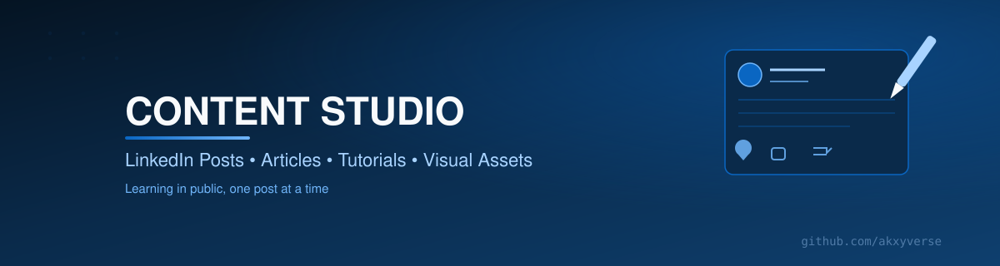

  

  

### 🎬 A Production Studio, Not a Drafts Folder
### Learning in public only works if the "public" part actually happens.

 

<table>
<tr>
<td width="25%" align="center" valign="top">

**🧭 What**

Every post, article, tutorial, and visual asset I create — start to finish.

</td>
<td width="25%" align="center" valign="top">

**💡 Why**

Content needs a production pipeline, not a scattered Drafts folder.

</td>
<td width="25%" align="center" valign="top">

**👥 Who**

Followers curious about the process, and other creators building their own pipeline.

</td>
<td width="25%" align="center" valign="top">

**🎁 Value**

A repeatable idea → draft → publish structure you can copy.

</td>
</tr>
</table>

### 🧭 Explore the Ecosystem

<table>
<tr>
<td align="center" width="12.5%"><a href="https://github.com/akxyverse"><b>🏠</b> Profile</a></td>
<td align="center" width="12.5%"><a href="https://github.com/akxyverse/data-analytics-knowledge-system"><b>🧠</b> Knowledge Hub</a></td>
<td align="center" width="12.5%"><a href="https://github.com/akxyverse/data-analytics-projects"><b>🚀</b> Projects</a></td>
<td align="center" width="12.5%"><a href="https://github.com/akxyverse/datasets"><b>📦</b> Datasets</a></td>
<td align="center" width="12.5%"><a href="https://github.com/akxyverse/data-analytics-resources"><b>📚</b> Resources</a></td>
<td align="center" width="12.5%"><a href="https://github.com/akxyverse/career-hub"><b>💼</b> Career</a></td>
<td align="center" width="12.5%"><b>✍️</b> Content</td>
<td align="center" width="12.5%"><a href="https://github.com/akxyverse/certifications"><b>🏅</b> Certs</a></td>
</tr>
</table>

<a href="https://github.com/akxyverse/ai-automation"><b>🤖 AI Automation</b></a>

---

## 🔥 Featured Content

<table>
<tr>
<td width="33%" align="center" valign="top">

**📊 HR Dashboard**
 Excel dashboard turning employee salary data into decision-ready KPIs.
 [View →](<./LinkedIn Posts/2026/08-August/2026-08-03_HR-Dashboard-Excel>)

</td>
<td width="33%" align="center" valign="top">

**📗 Excel Ultimate Guidebook**
 21-page handwritten-style guide, Excel basics through AI features.
 [View →](<./LinkedIn Posts/2026/07-July/2026-07-27_Excel-Ultimate-Guidebook>)

</td>
<td width="33%" align="center" valign="top">

**🤖 AI and the Future of Data Analysts**
 Why AI won't replace analysts — but analysts who use AI will win.
 [Read Article →](./Articles/Career/AI-and-the-Future-of-Data-Analysts.md)

</td>
</tr>
</table>

## 📂 Content Categories

| Category | Where | What's There |
|---|---|---|
| 📊 Dashboards | [`LinkedIn Posts`](<./LinkedIn Posts>) | 1 published |
| 📚 Guidebooks | [`LinkedIn Posts`](<./LinkedIn Posts>) | 4 published — Excel Roadmap, Syllabus, Ultimate Guidebook, Data Analyst Workflow |
| 📝 Career | [`Articles/Career`](./Articles/Career) + [`LinkedIn Posts`](<./LinkedIn Posts>) | 4 expanded articles, 4 archived posts |
| 📖 Resources | [`LinkedIn Posts`](<./LinkedIn Posts>) | 2 published |
| ✍️ Blogs / 🎓 Tutorials / 🐙 GitHub Content | *(empty scaffolding)* | Populated as real pieces move through the pipeline |

Full browsable gallery: **[LinkedIn Posts →](<./LinkedIn Posts>)**

## 🧭 Quick Navigation

- 🚀 **[Browse the LinkedIn Content Library](<./LinkedIn Posts>)** — every published post, by category
- 📰 **[Read the Articles](./Articles)** — long-form pieces expanded from posts
- 💡 **[Content Ideas](<./Content Ideas>)** — what's queued up next

## 🆕 Latest Updates

| What | Title | Date |
|---|---|---|
| LinkedIn Post | [HR Dashboard](<./LinkedIn Posts/2026/08-August/2026-08-03_HR-Dashboard-Excel>) | Aug 2026 |
| Article | [AI and the Future of Data Analysts](./Articles/Career/AI-and-the-Future-of-Data-Analysts.md) | Jul 2026 |

## 🗂 Repository Map

*How content moves through this repo — idea → draft → visual → publish.*

| Stage | Folder | Purpose |
|---|---|---|
| 💡 Idea | [`Content Ideas`](<./Content Ideas>) | Backlog of raw ideas, unfiltered |
| 📝 Draft | [`LinkedIn Posts`](<./LinkedIn Posts>) · [`Articles`](./Articles) · [`Blogs`](./Blogs) · [`Tutorials`](./Tutorials) | Using [`Content Templates`](<./Content Templates>) as the starting structure |
| 🎨 Visual | [`Images`](./Images) · [`Banners`](./Banners) · [`Thumbnails`](./Thumbnails) | Shared visual language across the ecosystem |
| 🚀 Publish | [`GitHub Content`](<./GitHub Content>) | Ships to LinkedIn, GitHub, or wherever it's meant for |

**LinkedIn Posts vs. Articles:** `LinkedIn Posts/` is the permanent record of everything published — every post archived as-is, browsable by category. Some posts are worth more than an archive entry — those get substantially rewritten (not copied) into `Articles/<Subject>/`, with the original graphics carried over, as a deeper knowledge piece. Every article started as a LinkedIn post; not every LinkedIn post becomes an article.

## ➡️ Recommended Next Repository

### 💼 [Career Hub](https://github.com/akxyverse/career-hub)
**Turn content into career momentum.** What gets published here builds the brand Career Hub puts to work.

---

**⭐ Star this repo if the structure is useful to you.**

Part of the <a href="https://github.com/akxyverse"><b>Akxyverse</b></a> Data Analytics ecosystem · MIT Licensed (published content/graphics are mine — credit appreciated) · <a href="./LICENSE">LICENSE</a>

